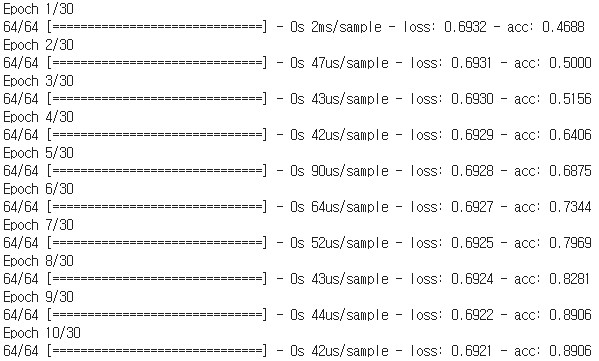
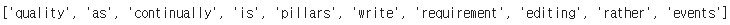

Word Embedding using Keras Skip-gram Word2Vec
===========================================

Keras implementation of Skip-gram Word2Vec.  
https://research.google/pubs/pub44876/  
Using About Wikipedia page.  
https://en.wikipedia.org/wiki/Wikipedia:About
	
    Distributed Representations of Words and Phrases and their Compositionality
    Tomas Mikolov, Ilya Sutskever, Kai Chen, Greg Corrado, Jeffrey Dean
    Neural and Information Processing System (NIPS) (2013)

Training Usage
-----

    python TrainingWeight.py train_data_file output_weight_file output_tokenizer_file

    ex)
    python TrainingWeight.py ./data/train_data.txt ./weight/embed_weight.pickle ./weight/tokenizer.pickle

Training Result
-----

Prediction Usage
-----

    python PredictSimilar.py input_weight_file input_tokenizer_file input_word output_word_count

    ex)
    python PredictSimilar.py ./weight/embed_weight.pickle ./weight/tokenizer.pickle wikipedia 10

Prediction Result
-----

